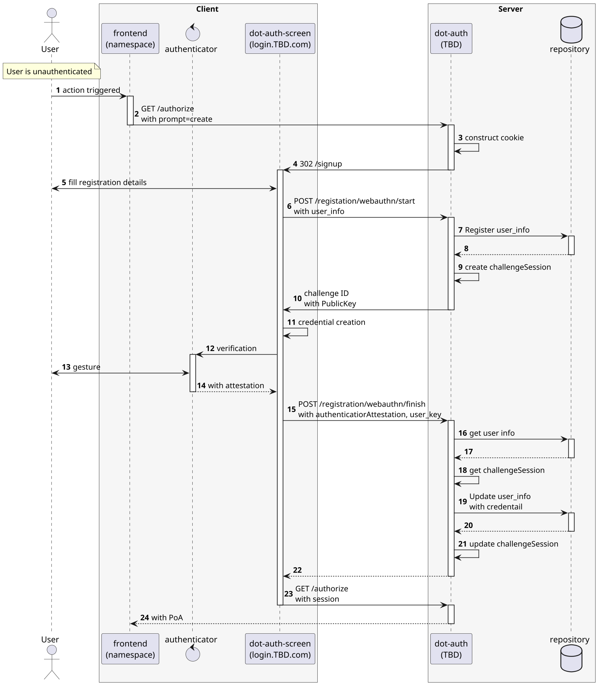
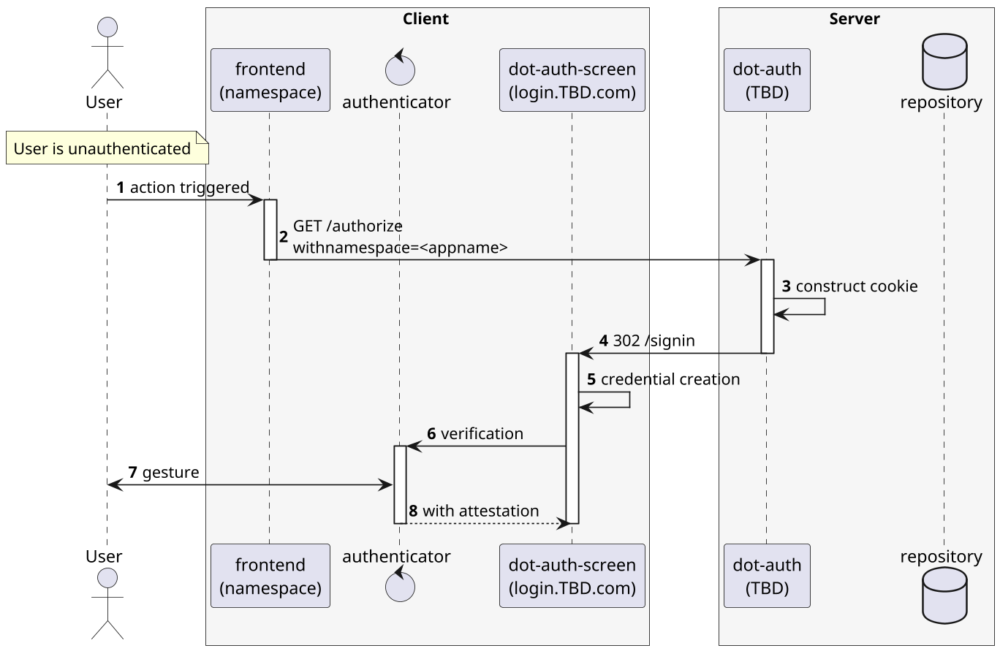

## Webauthn, cross-platform key

> Description of the payloads on [rfc6749](https://datatracker.ietf.org/doc/html/rfc6749)

### Register

```plantuml
@startuml registration-details
skinparam dpi 160
skinparam monochome false
skinparam BoxPadding 10

actor User as U

box Client #f6f6f6
participant "frontend\n(namespace)" as F
control "authenticator" as A
participant "dot-auth-screen\n(login.TBD.com)" as DAS
end box

box Server #f6f6f6
participant "dot-auth\n(TBD)" as DA
database "repository" as R
end box

autonumber

note over U
User is unauthenticated
end note


U -> F: action triggered


activate F
F -> DA: GET /authorize \nwith prompt=create
deactivate F


activate DA
DA -> DA: construct cookie
DA -> DAS: 302 /signup
deactivate DA


activate DAS
U <-> DAS: fill registration details
DAS -> DA: POST /registation/webauthn/start \nwith user_info

activate DA
DA -> R: Register user_info
activate R
R --> DA
deactivate R
DA -> DA: create challengeSession
DA -> DAS: challenge ID \nwith PublicKey
deactivate DA

DAS -> DAS: credential creation
DAS -> A: verification
activate A
A <-> U: gesture
A --> DAS: with attestation
deactivate A

DAS -> DA: POST /registration/webauthn/finish \nwith authenticatiorAttestation, user_key
activate DA
DA -> R: get user info
activate R
R --> DA
deactivate R
DA -> DA: get challengeSession
DA -> R: Update user_info \nwith credentail
activate R
R --> DA
deactivate R
DA -> DA: update challengeSession
DA --> DAS
deactivate DA
DAS -> DA: GET /authorize \nwith session
deactivate DAS
activate DA
DA --> F: with PoA
deactivate DA
```

### Login

```plantuml
@startuml registration-details
skinparam dpi 160
skinparam monochome false
skinparam BoxPadding 10

actor User as U

box Client #f6f6f6
participant "frontend\n(namespace)" as F
control "authenticator" as A
participant "dot-auth-screen\n(login.TBD.com)" as DAS
end box

box Server #f6f6f6
participant "dot-auth\n(TBD)" as DA
database "repository" as R
end box

autonumber

note over U
User is unauthenticated
end note


U -> F: action triggered


activate F
F -> DA: GET /authorize \nwithnamespace=<appname>
deactivate F


activate DA
DA -> DA: construct cookie
DA -> DAS: 302 /signin
deactivate DA


activate DAS


DAS -> DAS: credential creation
DAS -> A: verification
activate A
A <-> U: gesture
A --> DAS: with attestation
deactivate A


deactivate DAS
```
