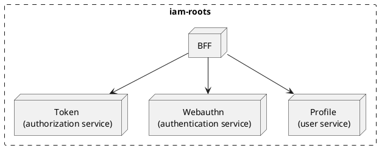
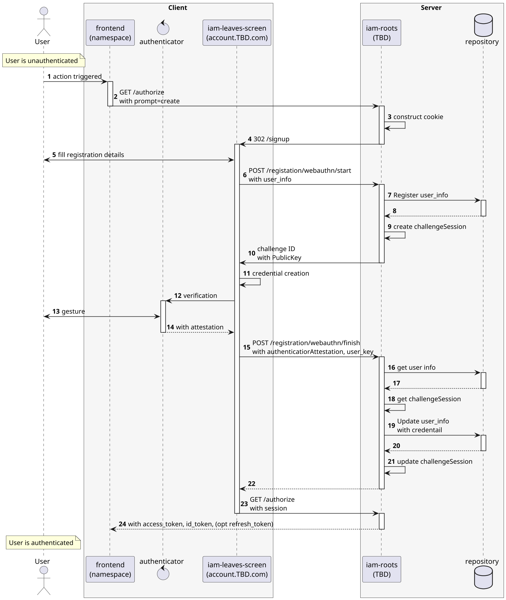
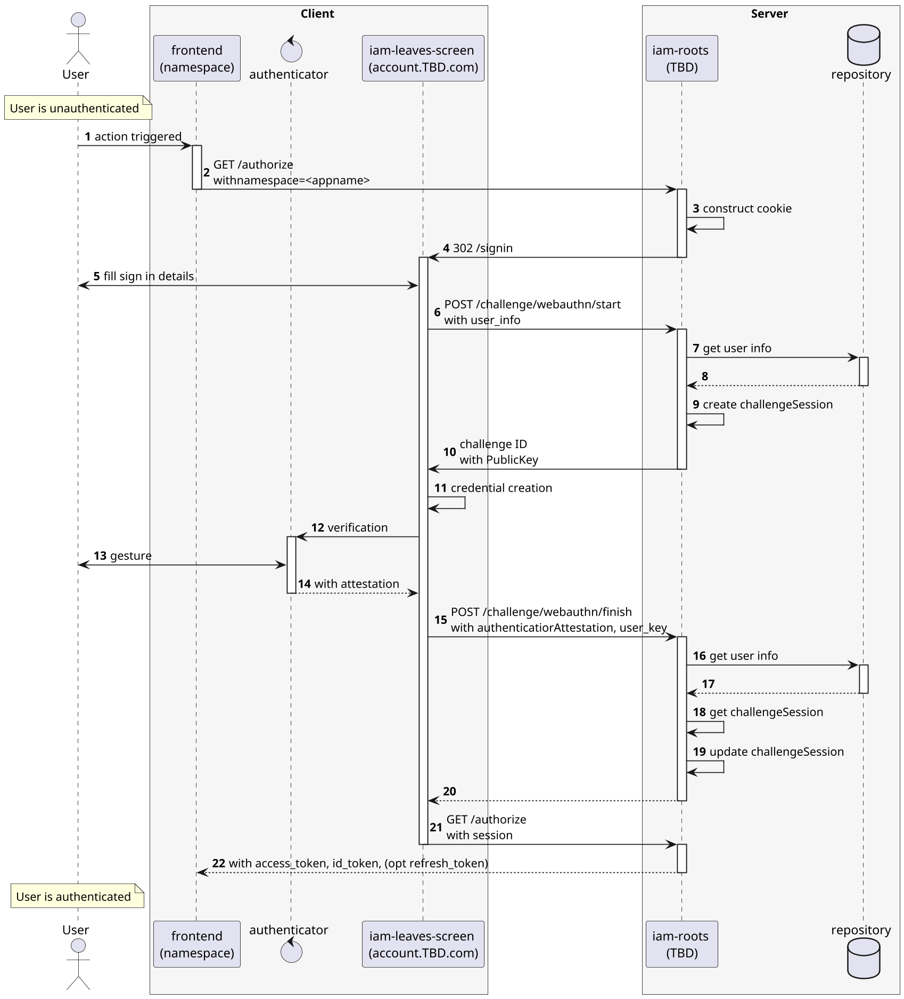

# IAM-roots

[toc]

## Overview

### BFF (Backend For Frontend)

Service that handles the user interaction, it is the only service that can interact with the user. It's configure to
allow GRPC and REST calls.

### Token

Service that handles the authorization. if the user is authenticated, it will return a token that can be used to access
the resources. If the user is not authenticated, it will return a redirect to the `iam-leaves` screen, triggering the
webauthn flow to either sign in or sign up the user. The token is a JWT token that contains the user information and
the permissions that the user has. The token is signed with a private key that is only known by the `iam-roots` service.
The following are the expected actions on the token service:

- `authorize`
- `token/refresh`
- `token/revoke`
- `token/validate`
- `token/verify`

### Webauthn

Service that handles the registration and authentication of the user. FIDO or Passkey are the only supported authenticator
methods at the moment. If another method is required, it will live in a different service. The following are the expected
actions on the webauthn service:

- `challenge`
- `registration`

### Profile

Service that handles the user information.
The following are the expected actions on the profile service:

- `user/registration`
- `user/update info`
- `user/delete`
- `user/get info`

## Webauthn/Token, cross-platform flow

> Description of the payloads on [rfc6749](https://datatracker.ietf.org/doc/html/rfc6749)

### Register

### Sign in

