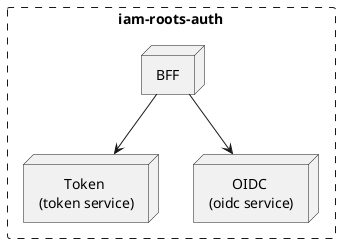

### BFF (Backend For Frontend)

Service that handles the user interaction, it is the only service that can interact with the user. It's configure to
allow **GRPC** and **REST** calls.

### Token

The token is a JWT token that contains the user information and the permissions that the user has. The token is signed with a private key that is only known by the `iam-XX` service.
The following are the expected actions on the token service:

- `token/refresh`
- `token/revoke`
- `token/verify`

### OIDC

Service that handles the authorization. if the user is authenticated, it will return a token that can be used to access
the resources. If the user is not authenticated, it will return a redirect to the `iam-leaves` screen, triggering the
[webauthn flow](/design/iam-roots-account/api/v1/) to either sign in or sign up the user.

Additionally, the OIDC service will handle the `id_token` and `access_token` that are required by the OIDC protocol.
The following are the expected actions on the OIDC service:

- `authorize`
