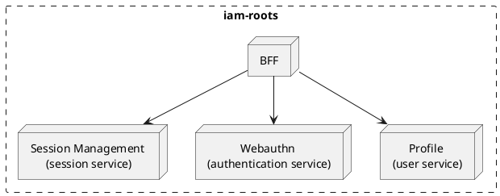

### BFF (Backend For Frontend)

Service that handles the user interaction, it is the only service that can interact with the user. It's configure to
allow **GRPC** and **REST** calls.

### Webauthn

Service that handles the registration and authentication of the user. FIDO or Passkey are the only supported authenticator
methods at the moment. If another method is required, it will live in a different service. The following are the expected
actions on the webauthn service:

- `challenge/webauthn/start`
- `challenge/webauthn/finish`
- `registration/webauthn/start`
- `registration/webauthn/finish`

### Profile

Service that handles the user information.
The following are the expected actions on the profile service:

- `user/registration`
- `user/update info` -> `user/update`
- `user/delete`
- `user/get info` -> `user/`

### Account Management

Service that handles the user active sessions. From this service, the user can revoke the sessions that are active.
The following are the expected actions on the account management service:

- `session/revoke`
- `session/get all` -> `session/list`
