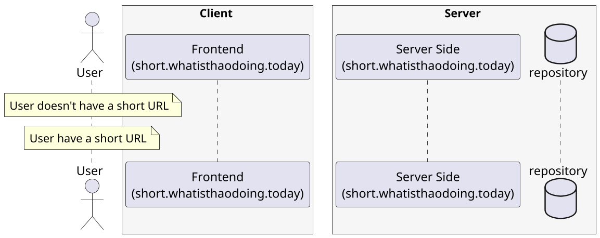
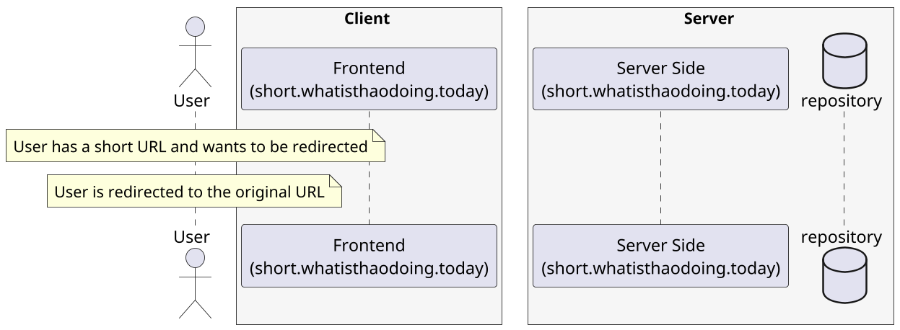

## Database

The Database is a transactional database that will store the short URL and the original URL. The database will be used by the Shorten URL service and the Redirect URL service.
We follow a database schema first approach, the schema will be defined in a SQL file and will be used to generate the required models, migrations, and seeds.

```sql
CREATE TABLE short_url (
-- TODO
);
```

- We use [pgtyped](https://github.com/adelsz/pgtyped) to generate types for our SQL queries.
- To manage the database migrations we use [dbmate](https://github.com/amacneil/dbmate).

For reusability, we have some helpers that will handle the database migrations and types generation. This is an example
of how we can use these helpers in our Makefile but it can be refactor to a script more suitable for the project:

```makefile
wait-for-it: dbmate
	@dbmate -u $(SQLITE_URL) wait

generate-types:
	@mkdir -p models && rm -f models/*.types.ts
	@npx pgtyped -w -c config.json

.PHONY: migrate
migrate: wait-for-it
	@dbmate -u $(SQLITE_URL) up
	@make generate-types
```

## System Design

### Register a new URL



### Redirect to the original URL


