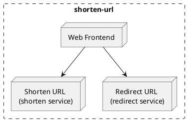

### Web Frontend

Service that handles the user interaction, it is the only service that can interact with the user.
This service will render the UI with mobile and desktop support.

- `/` -> `index.html`

### Shorten URL

Service that handles the shortening of the URL. It will generate a short URL that will be stored in the database.

- `/` `POST` -> Shorten URL and store it in the database

### Redirect URL

Service that handles the redirection of the URL. It will receive the short URL and redirect the user to the original URL.

- `/:short-url` `301` -> Redirect to the original URL
